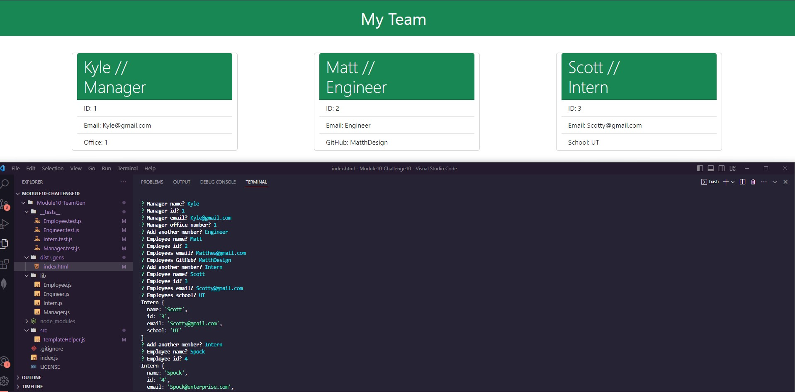
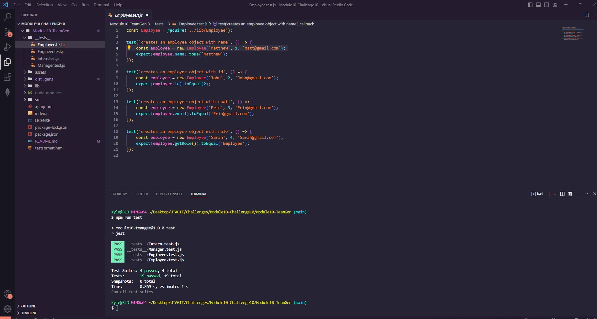

# Module10-TeamGen
Team Generator with Inquirer 
# **Module10-TeamGenerator**


## Table of Contents: 
#### [Description](#description)
#### [Installation](#installation)
#### [Usage](#usage)
#### [ScreenShot](#screenshot)
#### [License](#license)
#### [Profile](#profile)

## Description
#### Created an Bootstrap HTML Generator that uses an inquirer prompt and fs to write a HTML file with the user input.
#### This project was created to help a manager create a webpage that displays their team's basic info so that they have quick access to emails and GitHub profiles/Office Number/or school.


## Installation
###  Commands for Setup:
```
npm i  // from cloned repo folder
```

## Usage
### Commands to run:
```
npm run test // to run jest tests on all classes

npm run start or node index.js // initiates the inquirer prompt from terminal upon finishing all the prompts your html file will be generated in the "/dist/gens" folder  
```

## Screenshot
### 
### 
## License
### The MIT License  [](https://opensource.org/licenses/MIT) 
#### https://www.mit.edu/~amini/LICENSE.md


## Profile
#### Github Profile: https://github.com/KlyDesign

